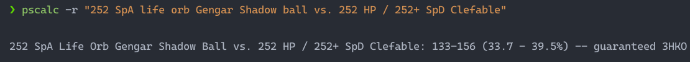
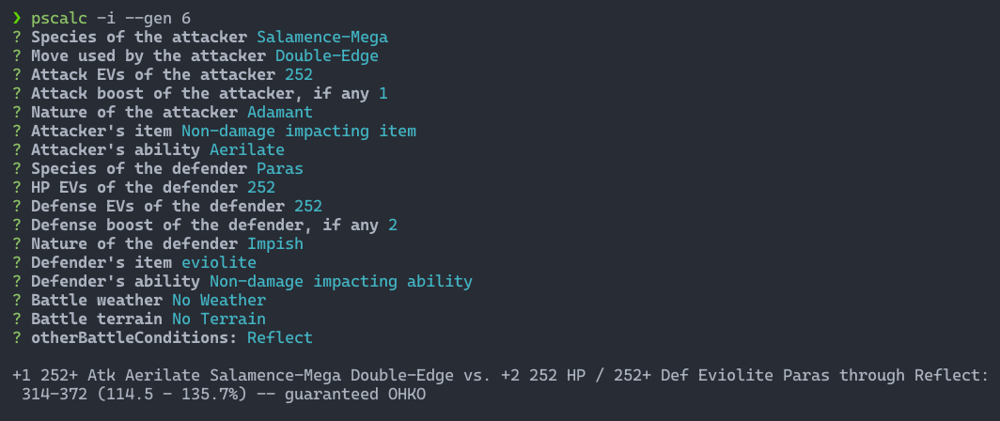

# Showdown damage calculator CLI

A simple, easy-to-use cli tool for quick pokemon damage calculations based on [Smogon's damage calulator](https://calc.pokemonshowdown.com)

## Installation

Try it with npx:
```bash
npx showdown-calc-cli
```

Or install globally using npm:
```bash
npm i -g showdown-calc-cli
```

## Usage





Run `pscalc --help` for more info
